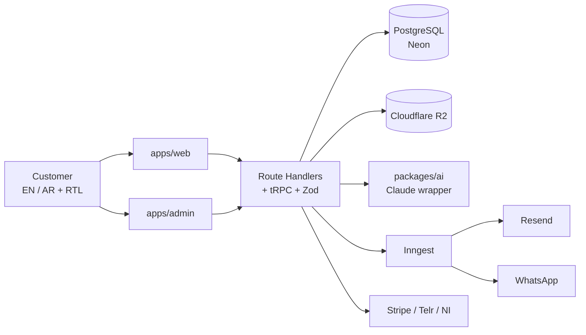

# Synergy Typing Services

> AI-powered platform for **Synergy Typing Services**, a licensed UAE typing centre in **Musaffah, Abu Dhabi**. Replaces [synergytyping.com](https://synergytyping.com/) with a bilingual (EN + AR) self-service portal for government e-services: immigration, labour, company formation, transport, real estate, attestation, medical, and more.

[](https://github.com/ddotsmediahosting-glitch/synergy-typing-services/actions/workflows/ci.yml)

---

## Table of contents

- [Overview](#overview)
- [Architecture](#architecture)
- [Stack rationale](#stack-rationale)
- [Monorepo layout](#monorepo-layout)
- [Local setup](#local-setup)
- [Scripts](#scripts)
- [Brand & design tokens](#brand--design-tokens)
- [Deployment](#deployment)
- [Phase roadmap](#phase-roadmap)
- [Contribution notes](#contribution-notes)

---

## Overview

Typing centres are the front door to UAE government e-services. This platform lets customers discover a service, see the exact document checklist, estimate fees (government + service + 5% VAT), apply online, upload documents securely, pay, and track status — in **English or Arabic**, with full RTL.

**Phase 1 scope (customer site + AI + state machine + admin MVP):** 12 customer routes, 7 AI surfaces, application lifecycle state machine, secure document handling, bilingual notifications, and a staff console. See [`docs/phases.md`](docs/phases.md).

**Live reference site (existing):** https://synergytyping.com/
**Business details** (fetched from the live site — hours and TRN `TO VERIFY`):

- Address: Shop #35, Al Maldieve Centre, Musaffah Industrial Area 10, Abu Dhabi, UAE
- Main phone: +971 2 554 2220
- WhatsApp: +971 50 660 1090
- Email: info@synergytyping.com

---

## Architecture



Full ERD, request flow, state machine, role matrix, and i18n strategy: [`docs/architecture.md`](docs/architecture.md). Security posture, PII rules, and retention: [`docs/security.md`](docs/security.md).

---

## Stack rationale

| Layer | Choice | Why |
| --- | --- | --- |
| Monorepo | pnpm + Turborepo | Shared packages (`ui`, `db`, `api`, `ai`), fast incremental builds, low overhead. |
| App framework | Next.js 15 + React 19 | App Router + RSC → bilingual SSR for SEO, minimal client JS for Core Web Vitals. |
| Styling | Tailwind + shadcn/ui | Token-driven design system; zero runtime; trivial RTL via logical properties. |
| Animation | Framer Motion | Respects `prefers-reduced-motion`; accessible by default. |
| i18n | next-intl | `/[locale]/...` routing with typed messages; plays cleanly with App Router. |
| API | Route Handlers + tRPC + Zod | End-to-end typed contracts; Zod is the validation boundary everywhere. |
| Jobs | Inngest | Durable state machine transitions, retries, scheduled purges — all on free tier. |
| DB | Neon PostgreSQL + Prisma | Generous free tier, branching for previews, typed client. |
| Auth | Auth.js v5 | Email magic link, Google, UAE Pass placeholder. Role-gated sessions. |
| Storage | Cloudflare R2 | S3-compatible, zero egress, generous free tier. |
| Payments | Stripe (+ adapters) | Cards / Apple Pay / Google Pay on day 1; Telr + Network International stubs for local UAE cards. |
| Email | Resend + React Email | Bilingual templates authored in JSX. |
| AI | Anthropic Claude via `@anthropic-ai/sdk` | Strong multilingual quality; wrapped in `packages/ai` with cache, spend cap, injection filter, kill switch. |
| Observability | Sentry + PostHog | Error tracking + product analytics with EU region option. |
| Hosting | Vercel + Neon + Upstash + Inngest | All generous free tiers; predictable cost scaling. |

---

## Monorepo layout

```
.
├── apps/
│   ├── web/                 # customer site (Next.js 15)
│   └── admin/               # staff console (Next.js 15)
├── packages/
│   ├── ui/                  # shadcn/ui + brand components
│   ├── db/                  # Prisma schema + client
│   ├── api/                 # tRPC routers + Zod schemas
│   ├── ai/                  # Anthropic wrapper + prompt registry
│   ├── emails/              # React Email templates (EN/AR)
│   └── config/              # tsconfig, eslint, tailwind, brand tokens
├── docs/
│   ├── architecture.md
│   ├── security.md
│   └── phases.md
├── assets/                  # logo, business card
├── .github/workflows/ci.yml
├── turbo.json
├── pnpm-workspace.yaml
├── tsconfig.base.json
└── .env.example
```

Package boundaries and import direction are documented in [`docs/architecture.md`](docs/architecture.md#7-monorepo-boundaries).

---

## Local setup

### Prerequisites

- **Node.js** ≥ 20.11
- **pnpm** ≥ 9 (the repo pins `10.33.0` via `packageManager`)
- **Git** ≥ 2.40

### First run

```bash
# 1. Install deps
pnpm install

# 2. Copy env template
cp .env.example .env.local
# Fill in any local values you need (most optional at Phase 0).

# 3. Run everything in dev
pnpm dev
```

At Phase 0 the dev scripts are placeholders — they echo a reminder that app code lands in Phase 1 Step 1. Once Step 1 is merged, `pnpm dev` will boot `apps/web` on `localhost:3000` (EN at `/`, AR at `/ar`) and `apps/admin` on `localhost:3001`.

---

## Scripts

Root scripts (run from repo root):

| Script | Does |
| --- | --- |
| `pnpm dev` | Turbo dev for all apps/packages that declare `dev`. |
| `pnpm build` | Turbo production build across the graph. |
| `pnpm lint` | ESLint across all workspaces. |
| `pnpm typecheck` | `tsc --noEmit` across all workspaces. |
| `pnpm format` | Prettier write across the repo. |
| `pnpm format:check` | Prettier check (CI uses this). |
| `pnpm test` | Turbo test (only packages with business logic have tests). |
| `pnpm clean` | Remove build artefacts + `node_modules`. |

Husky runs `lint-staged` on `pre-commit` (Prettier on staged files).

---

## Brand & design tokens

Source of truth: [`packages/config/tokens/brand.ts`](packages/config/tokens/brand.ts). Tailwind config and CSS variables consume these — do not hardcode colours elsewhere.

| Token | Value | Use |
| --- | --- | --- |
| `--brand-primary` | `#0F1E4C` | Navy from the "SYNERGY" wordmark. Headings, nav, primary buttons. |
| `--brand-secondary` | `#5DBCC9` | Teal from the logo mark. Links, accents, hover states. |
| `--brand-accent` | `#C9A14A` | UAE gold. CTAs, trust badges, government-style highlights. |
| `--ink` | `#0B1220` | Body text. |
| `--surface` | `#F5F7FA` | Page surfaces, cards. |
| `--muted` | `#6B7280` | Subtext (matches "TYPING SERVICES" gray). |
| `--success` / `--warning` / `--danger` | `#1F8E5C` / `#D97706` / `#DC2626` | State colours. |

**Typography:** Cairo (primary, supports AR + Latin) · Inter (Latin fallback), via `next/font`.

**Logo:** [`assets/SYNERGY LOGO-01.png`](assets/SYNERGY%20LOGO-01.png) (full lockup), [`assets/SYNERGY LOGO-02.png`](assets/SYNERGY%20LOGO-02.png) (mark only).

---

## Deployment

- **Hosting:** Vercel (one project per app: `synergy-web`, `synergy-admin`).
- **DB:** Neon, one main branch + per-PR preview branches.
- **Storage:** Cloudflare R2 bucket `synergy-docs`.
- **Jobs:** Inngest cloud.
- **Cache / rate limit:** Upstash Redis (EU region).
- **Observability:** Sentry + PostHog EU.
- **Env:** secrets live in Vercel; `.env.example` is the only committed env file.

CI (`.github/workflows/ci.yml`) runs `format:check → lint → typecheck → build` on every push and PR to `main`.

---

## Phase roadmap

- **Phase 0** _(this commit):_ scaffold + docs. No app code.
- **Phase 1:** customer site (12 routes), AI surfaces, state machine, admin MVP. See [`docs/phases.md`](docs/phases.md).
- **Phase 2:** UAE Pass SSO, Telr / Network International go-live, WhatsApp Business API, reviewer mode, Expo mobile app.

---

## Contribution notes

- Small, reviewable steps. One Phase 1 ticket per PR.
- Every PR checks: bilingual copy, RTL audit, no PII in logs/URLs, Zod on inputs, docs updated if the contract changed (see `.github/PULL_REQUEST_TEMPLATE.md`).
- No new paid dependency without discussion.
- Commit style: Conventional Commits (`feat:`, `fix:`, `docs:`, `chore:`...).
- TypeScript strict mode + `noUncheckedIndexedAccess` — don't silence errors; fix the type.

---

© Synergy Typing Services — UAE Typing Centre, Abu Dhabi.
