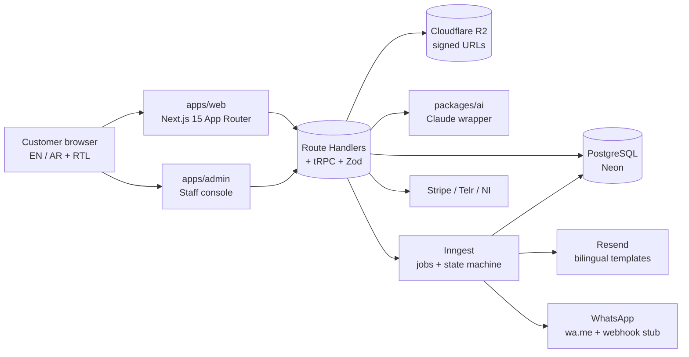
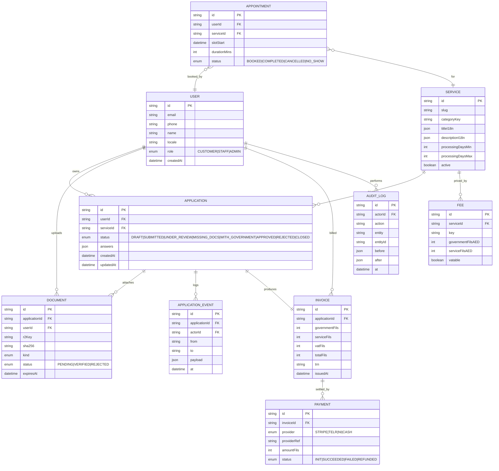
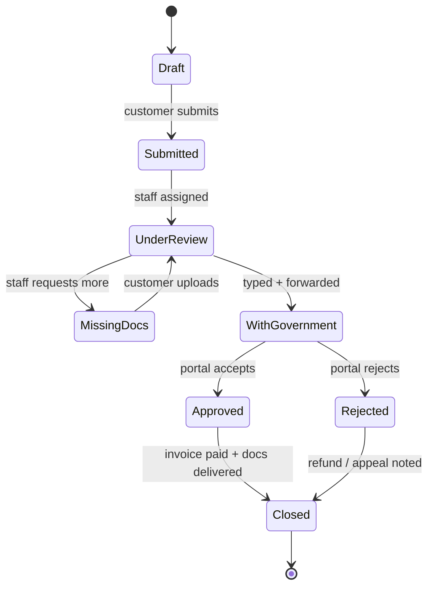
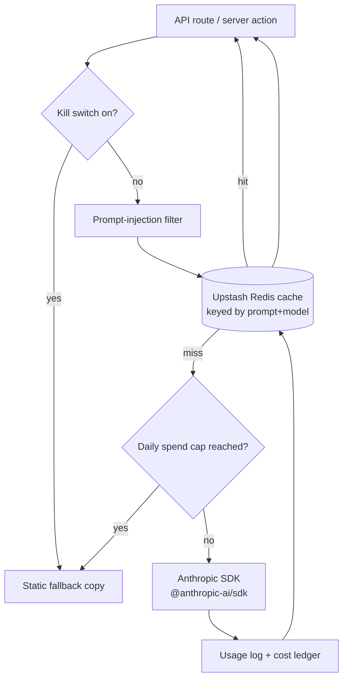

# Architecture — Synergy Typing Services

> Status: Phase 0 scaffold. Updated as Phase 1 tickets land.

---

## 1. High-level request flow

---

## 2. Data model (ERD)

All money is stored as integer fils (AED × 100). VAT 5% is computed on the service portion only and broken out on every invoice (UAE FTA style).

---

## 3. Application state machine

Transitions emit Inngest events. Each event fans out to:
- DB write (`application_event`)
- Email (Resend, bilingual)
- WhatsApp stub (wa.me link in Phase 1; Business API in Phase 2)
- Audit log entry

---

## 4. AI layer (`packages/ai`)

Surfaces:
- Service recommender (`/assistant`, home)
- Document checklist assistant (`/services/[slug]`, `/apply/[slug]`)
- Fee-calculator explainer (`/fee-calculator`)
- Document OCR + form auto-fill (apply wizard)
- In-form helper (apply wizard)
- Multilingual chatbot (floating)
- Status explainer (`/track`, `/account`)

Cache TTL: 24 h for static explanations; 1 h for chat; no cache for anything PII-touching.

---

## 5. Role matrix

| Capability | CUSTOMER | STAFF | ADMIN |
| --- | :-: | :-: | :-: |
| Start / submit own applications | ✅ | ✅ | ✅ |
| Upload own documents | ✅ | ✅ | ✅ |
| Pay own invoices | ✅ | ✅ | ✅ |
| View own applications | ✅ | ✅ | ✅ |
| View all applications in queue | ❌ | ✅ | ✅ |
| Transition application state | ❌ | ✅ | ✅ |
| Verify / reject documents | ❌ | ✅ | ✅ |
| Edit service catalogue + fees | ❌ | ❌ | ✅ |
| Manage users / roles | ❌ | ❌ | ✅ |
| Read audit log | ❌ | read-only | ✅ |

Auth.js v5 sessions carry `role`. Every mutation is role-gated server-side (never trust the client).

---

## 6. i18n strategy

- `next-intl` with `/[locale]/...` routing. Locales: `en` (default), `ar`.
- Arabic routes render with `<html dir="rtl" lang="ar">`.
- Messages live in `apps/web/messages/{en,ar}.json`, scoped per route namespace.
- Service titles, descriptions, and FAQ items are stored as `json` columns with `{ en, ar }` — not English-only with translations bolted on.
- Fonts: **Cairo** for AR + Latin headings, **Inter** Latin fallback, via `next/font`.
- Numerals: Arabic-Indic digits configurable per locale; currency always `AED` with two decimals.
- RTL audit checklist (icons, carousels, form alignment, charts) enforced in the PR template.

---

## 7. Monorepo boundaries

| Package | Imports from | Exports to |
| --- | --- | --- |
| `packages/config` | — | all |
| `packages/ui` | `config` | `web`, `admin` |
| `packages/db` | `config` | `api` |
| `packages/api` | `db`, `ai`, `emails` | `web`, `admin` |
| `packages/ai` | `config` | `api` |
| `packages/emails` | `config` | `api` |
| `apps/web` | `api`, `ui`, `config` | — |
| `apps/admin` | `api`, `ui`, `config` | — |

Apps never import `db` directly — all DB access flows through `packages/api`.
